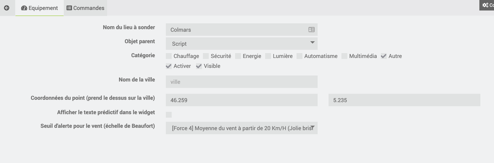

Description
===

Ce plugin annonce les prochaines alertes (72H) météo en France, Belgique et Suisse. Previsy construit également des phrases qui peuvent être utilisées pour vous être envoyées par sms, annoncées par votre home ou slack etc… 

**Exemple**
> Dans 23 heures, soit demain à partir de 20 heures, un orage est prévu durant 1 heure. Il y aura un total de 0.7 millimètre de précipatation. Le taux d’humidité sera de 86.0%. La température sera de 13.1°C. Le vent soufflera en moyenne à 8.0KM/H avec des rafales pouvant aller jusqu’à 13.0KM/H

Vous pourrez, bien évidemment, récupérer les données brutes pour créer des scénarios particuliers.

Installation
===

### Le plugin utilise prevision-meteo.ch

### Configuration

- **Nombre d'alerte en prévision à afficher**
> Cela permet de configurer le nombre d'alertes que vous souhaitez afficher. 

> Exemple : "Pour toujours afficher les deux prochaines alertes on sélectionne 2 alertes."

- **Temperature**
> Vous avez la possibilité d'afficher les températures en degrés Celsius (°C) ou en degrés Fahrenheit (°F)

- **Commandes à afficher (en option pour vos scénarios)**
> Si vous souhaitez utiliser certaines données pour vous créer des scénarios sur mesures. Il suffit de cocher les commandes que vous souhaitez voir apparaitre.

> Toutes les commandes seront décrite par la suite. 

> Attention, si vous voulez afficher 5 alertes et toutes les commandes vous allez en avoir beaucoup ! 

Gestion
===

### Equipement

### Commandes

Le nombre de commande sera forcément proportionnel au nombre d'alerte que vous avez configuré.

#### Les commandes générales

- **SynchroVille [info]**
> Cela correspond à la ville que vous avez enregistré.

- **SynchroLastUpDate [info]**
> Date au format "timestamp" de la dernière synchronisation avec le site prevision-meteo.ch

- **Rafraichir [action]**
> La fameuse commande permettant de raffraichir le widget. Cela lancera un synchro au prêt de prevision-meteo.ch

#### Les commandes liées aux alertes

Dans les prochaines commandes le "01" correspond au numéro de l'alerte associé à la valeur. Il peut donc y avoir cinq déclinaisons si vous avez configuré 5 alertes.

- **Alerte+01_txt_full [info]**
> C'est la phrase complète. Elle comporte toutes les indications lié à la météo. 
> Exemple : "Dans 18 heures, soit demain à partir de 16 heures, il va pleuvoir durant 1 heure. Il y aura un total de 0.3 millimètre de précipatation. Le taux d'humidité sera de 99.0%. La température sera de 10.5°C. Le vent soufflera en moyenne à 24.0KM/H avec des rafales pouvant aller jusqu'à 38.0KM/H."

- **Alerte+01_txt_start [info] (optionnel)**
> C'est la première partie de la pharse complète. 

> Exemple : "Dans 18 heures, soit demain à partir de 16 heures, il va pleuvoir durant 1 heure."

- **Alerte+01_txt_mm [info] (optionnel)**
> C'est la partie liée à la précipitation. 

> Exemple : "Il y aura un total de 0.3 millimètre de précipatation."

- **Alerte+01_txt_humidite [info] (optionnel)**
> C'est la partie liée à l'humidité. 

> Exemple : "Le taux d'humidité sera de 99.0%."

- **Alerte+01_txt_temperature [info] (optionnel)**
> C'est la partie liée à la température. 

> Exemple : "La température sera de 10.5°C."

- **Alerte+01_txt_vent [info] (optionnel)**
> C'est la partie lié au vent. 

> Exemple : "Le vent soufflera en moyenne à 24.0KM/H avec des rafales pouvant aller jusqu'à 38.0KM/H."

***Vous l'aurez compris, cela vous permettra de reconstruire vos phrases comme vous le souhaitez.***

- **Alerte+01_dans_heure [info]**
> Temps en heure de l'alerte

- **Alerte+01_date_start [info]**
> #########

- **Alerte+01_date_end [info]**
> #########

- **Alerte+01_type [info] (optionnel)[info]**
> #########

- **Alerte+01_condition_max [info] (optionnel)[info]**
> #########

- **Alerte+01_duree [info] (optionnel)[info]**
> #########

- **Alerte+01_mm_max [info] (optionnel)**
> #########

- **Alerte+01_mm_moyenne [info] (optionnel)**
> #########

- **Alerte+01_mm_total [info] (optionnel)**
> #########

- **Alerte+01_temp_max [info] (optionnel)**
> #########

- **Alerte+01_temp_moyenne [info] (optionnel)**
> #########

- **Alerte+01_humidite_max [info] (optionnel)**
> #########

- **Alerte+01_humidite_moyenne [info] (optionnel)**
> #########

- **Alerte+01_vent_max [info] (optionnel)**
> #########

- **Alerte+01_vent_moyenne [info] (optionnel)**
> #########

- **Alerte+01_vent_nom [info] (optionnel)**
> #########

- **Alerte+01_rafale_max [info] (optionnel)**
> #########

- **Alerte+01_rafale_moyenne [info] (optionnel)**
> #########

