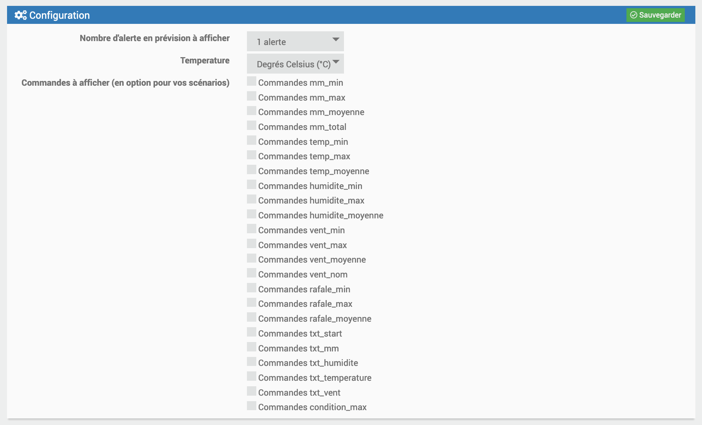

Description
===

Ce plugin annonce les prochaines alertes météo. Previsy construit également des phrases qui peuvent être utilisées pour vous être envoyées par sms, annoncées par votre home ou slack etc … 

**Exemple**
> Dans 23 heures, soit demain à partir de 20 heures, un orage est prévu durant 1 heure. Le taux d’humidité sera de 86.0%. La température sera de 13.1°C. Le vent soufflera en moyenne à 8.0KM/H avec des rafales pouvant aller jusqu’à 13.0KM/H

Vous pourrez, bien évidemment, récupérer les données brutes pour créer des scénarios particuliers.

Installation
===

### Le plugin utilise prevision-meteo.ch

Gestion
===

### Equipement

### Commandes

#####  Test